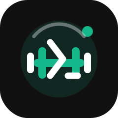
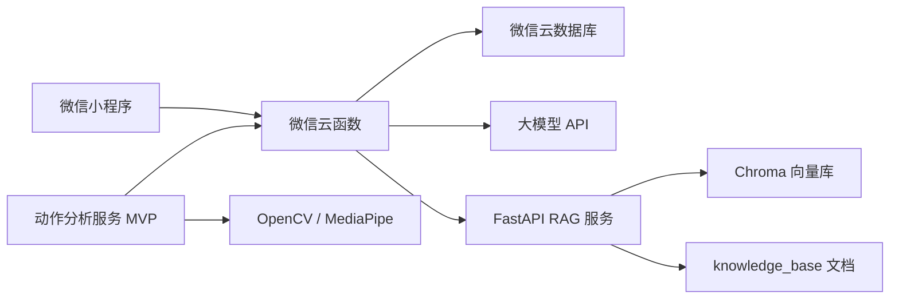
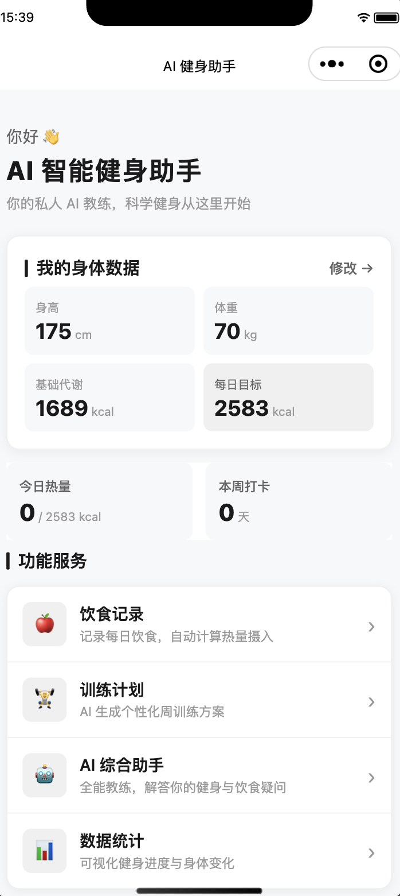
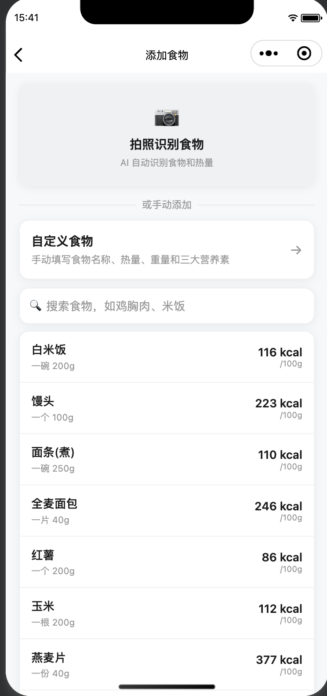
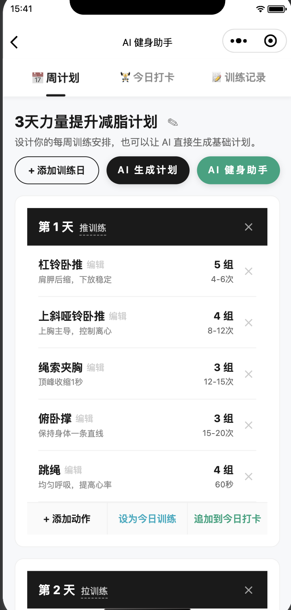
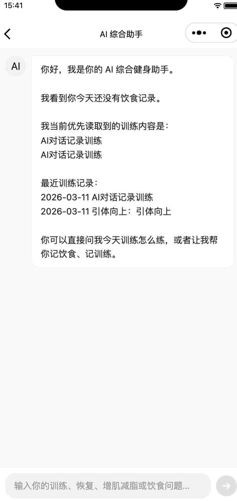
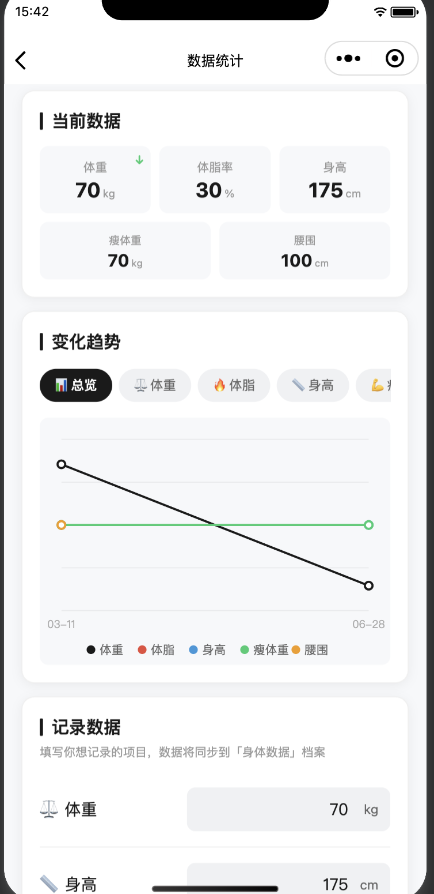

<div align="center">
  
  <h1>FitAgent：AI 智能健身助手微信小程序</h1>
</div>

FitAgent 是一个基于微信小程序、云开发、FastAPI RAG 服务和大模型 API 的智能健身助手，支持用户档案管理、饮食记录、AI 食物识别、训练计划生成、健身问答和身体数据追踪。

## 项目简介

FitAgent 面向有减脂、增肌、保持健康等需求的普通健身用户。项目希望解决日常健身中“记录麻烦、建议泛化、数据分散、反馈不连续”的问题：用户可以在小程序中维护个人档案，记录饮食和训练，通过 AI 获取饮食分析、训练建议和自然语言问答，并将关键结果沉淀到云数据库中。

项目整体流程围绕“记录数据 -> 调用 AI 分析 -> 结构化存储 -> 长期追踪”展开。小程序负责用户交互和数据展示，微信云函数负责业务编排、数据库读写和大模型调用，FastAPI RAG 服务负责健身知识检索增强，动作分析服务作为后续动作纠正能力的 MVP 扩展。

## 项目亮点

- **微信小程序与云开发闭环**：基于微信原生小程序实现多页面业务流程，通过云函数和云数据库完成用户档案、饮食记录、训练计划、训练打卡和身体数据管理。
- **统一 AI 调用入口**：核心云函数 `aiSuggest` 封装食物图片识别、饮食总结、训练计划生成和健身问答等能力，并包含超时、重试和备用模型回退逻辑。
- **多模态食物识别**：用户上传食物图片后，小程序先上传到云存储，再由云函数获取临时访问地址并调用视觉模型，返回结构化的食物名称、热量和三大营养素估算。
- **RAG 增强问答服务**：独立 FastAPI 服务读取 `knowledge_base` 中的健身知识文档，使用 Embedding 和 ChromaDB 建立向量索引，为健身问答提供可检索的知识上下文。
- **结构化输出与自动记账**：AI 对话中支持隐藏标签 `$$RECORD[...]$$` 和 `$$WORKOUT[...]$$`，云函数解析后自动写入饮食和训练记录，减少用户手动录入成本。
- **动作分析服务 MVP**：仓库包含基于 FastAPI、OpenCV、MediaPipe 的动作分析服务雏形，支持异步接收视频分析任务并通过回调更新 `motion_tasks`，为后续动作纠正能力预留扩展路径。

## 功能模块

| 模块 | 功能说明 |
| --- | --- |
| 首页概览 | 展示今日饮食、训练和身体数据摘要，提供主要功能入口 |
| 用户档案 | 维护性别、年龄、身高、体重、目标、训练频率和营养比例等基础信息 |
| 饮食记录 | 支持按餐次记录食物、搜索本地食物库、自定义食物和图片识别估算营养 |
| AI 综合助手 | 结合用户档案、饮食记录和训练记录进行健身问答、饮食建议和自然语言记录 |
| 训练计划 | 根据目标和训练频率生成周训练计划，支持保存、编辑、导入今日训练和打卡 |
| 身体数据 | 记录体重、体脂、腰围、瘦体重等数据，并通过小程序 Canvas 展示趋势 |
| RAG 知识库 | 通过 FastAPI 服务检索健身知识文档，增强 AI 回答的专业性和场景相关性 |
| 动作分析 MVP | 接收动作视频分析任务，使用姿态识别结果生成评分、总结和回调结果 |
| 云函数层 | 统一处理 AI 调用、用户信息保存、身体数据读写和动作任务查询/更新 |

## 技术栈

| 类别 | 技术 |
| --- | --- |
| 前端 | 微信原生小程序、JavaScript、WXML、WXSS、Canvas |
| 后端 | 微信云函数、Node.js、FastAPI、Uvicorn |
| AI / 大模型 | 硅基流动 OpenAI-compatible API、Kimi-K2.5、GLM-4.7 备用模型、Prompt 设计、结构化输出解析 |
| RAG / 向量检索 | ChromaDB、BAAI/bge-m3 Embedding、知识库 Markdown 文档、httpx |
| 动作分析 | OpenCV、MediaPipe、NumPy、异步任务回调 |
| 数据库与存储 | 微信云数据库、微信云存储、Chroma 本地向量库 |
| 工程工具 | Git、微信开发者工具、Python venv、requirements.txt、环境变量配置 |

## 项目结构

```text
FitAgent/
├── README.md                              # 项目说明文档
├── README_RAG.md                          # RAG 服务补充说明
├── project.config.json                    # 微信开发者工具项目配置
├── knowledge_base/                        # RAG 使用的健身知识库 Markdown 文档
└── jianshenzhushou/
    ├── miniprogram/                       # 微信小程序前端
    │   ├── app.js                         # 小程序初始化与云开发环境配置
    │   ├── app.json                       # 页面路由与全局配置
    │   ├── app.wxss                       # 全局样式
    │   ├── pages/
    │   │   ├── index/                     # 首页概览
    │   │   ├── profile/                   # 用户档案
    │   │   ├── diet/                      # 饮食列表与每日总结
    │   │   ├── diet-add/                  # 新增饮食与图片识别
    │   │   ├── ai-chat/                   # AI 综合问答
    │   │   ├── workout/                   # 训练计划与打卡
    │   │   ├── workout-ai-chat/           # 训练相关 AI 对话页面
    │   │   └── body-stats/                # 身体数据记录与趋势
    │   └── utils/                         # 小程序工具函数
    ├── cloudfunctions/                    # 微信云函数
    │   ├── aiSuggest/                     # AI 调用、RAG 转发、结构化标签解析
    │   ├── saveUserProfile/               # 保存用户档案
    │   ├── saveBodyStats/                 # 保存身体数据
    │   ├── getBodyStats/                  # 查询身体数据
    │   ├── listMotionTasks/               # 查询动作分析任务列表
    │   ├── getMotionTask/                 # 查询单个动作分析任务
    │   └── updateMotionTask/              # 动作分析服务回调更新任务
    ├── rag-service/                       # FastAPI RAG 服务
    │   ├── app/
    │   │   ├── main.py                    # /healthz、/rag/reindex、/rag/chat
    │   │   ├── core/                      # 配置、LLM 客户端、向量库逻辑
    │   │   ├── schemas/                   # 请求与响应模型
    │   │   └── services/                  # 文档加载、切分、检索和问答服务
    │   ├── requirements.txt               # RAG 服务 Python 依赖
    │   └── .env.example                   # RAG 服务环境变量示例
    ├── motion-analysis-service/           # 动作分析 FastAPI 服务 MVP
    │   ├── app/
    │   │   ├── main.py                    # /healthz、/analyze-motion
    │   │   ├── core/                      # 服务配置
    │   │   ├── schemas/                   # 动作分析请求与回调模型
    │   │   └── services/                  # 视频下载、姿态分析和回调客户端
    │   ├── requirements.txt               # 动作分析服务 Python 依赖
    │   └── README.md                      # 动作分析服务说明
    └── docs/
        └── motion-correction-mvp.md       # 动作纠正 MVP 设计说明
```

## 核心流程



## 快速开始

### 1. 克隆项目

```bash
git clone git@github.com:LiPeiCong60/FitAgent.git
cd FitAgent
```

### 2. 启动微信小程序

1. 使用微信开发者工具导入项目目录。
2. 将 `jianshenzhushou/miniprogram/app.js` 中的云开发环境 ID 替换为自己的环境。
3. 在微信云开发控制台创建所需集合，例如 `users`、`diet_logs`、`workout_records`、`training_plans`、`body_stats`、`motion_tasks`。
4. 上传并部署 `jianshenzhushou/cloudfunctions/` 下的云函数。
5. 为 `aiSuggest` 云函数配置大模型 API Key 和 RAG 服务地址。

小程序端没有独立的 npm 启动脚本，运行和调试主要依赖微信开发者工具。

### 3. 启动 RAG 服务

```bash
cd jianshenzhushou/rag-service
python -m venv .venv
source .venv/bin/activate
pip install -r requirements.txt
cp .env.example .env
uvicorn app.main:app --reload --host 0.0.0.0 --port 8001
```

启动后可访问：

- 接口文档：`http://127.0.0.1:8001/docs`
- 健康检查：`http://127.0.0.1:8001/healthz`

如需让云函数访问本地 RAG 服务，需要使用公网部署地址或内网穿透地址，并配置到 `RAG_SERVICE_URL`。

### 4. 启动动作分析服务

```bash
cd jianshenzhushou/motion-analysis-service
python -m venv .venv
source .venv/bin/activate
pip install -r requirements.txt
uvicorn app.main:app --reload --host 0.0.0.0 --port 8000
```

启动后可访问：

- 接口文档：`http://127.0.0.1:8000/docs`
- 健康检查：`http://127.0.0.1:8000/healthz`

当前 `motion-analysis-service` 目录未提供 `.env.example`，需要根据部署环境补充回调地址、回调令牌和工作目录等配置。

## 环境变量说明

### `aiSuggest` 云函数

```env
SILICONFLOW_API_KEY=your_api_key_here
RAG_ENABLED=true
RAG_SERVICE_URL=https://your-rag-service.example.com/rag/chat
RAG_SERVICE_TOKEN=optional_shared_token
RAG_SERVICE_TIMEOUT_MS=12000
```

### RAG 服务

`jianshenzhushou/rag-service/.env.example` 已提供基础配置，可按实际环境复制为 `.env`：

```env
SILICONFLOW_API_KEY=your_api_key_here
SILICONFLOW_BASE_URL=https://api.siliconflow.cn/v1
RAG_CHAT_MODEL=Pro/moonshotai/Kimi-K2.5
RAG_EMBEDDING_MODEL=BAAI/bge-m3
RAG_TOP_K=5
RAG_API_TOKEN=change_me_optional_shared_token
RAG_KNOWLEDGE_BASE_DIR=../../knowledge_base
RAG_CHROMA_DIR=.chroma
RAG_CHUNK_SIZE=700
RAG_CHUNK_OVERLAP=120
RAG_REQUEST_TIMEOUT_SECONDS=45
RAG_EMBEDDING_BATCH_SIZE=24
RAG_CHROMA_COLLECTION=fitagent_knowledge
```

### 动作分析服务与回调

```env
MOTION_ANALYSIS_FPS=6
MOTION_WORKSPACE_DIR=tmp
MOTION_MOTION_CALLBACK_URL=https://your-cloud-function-callback.example.com
MOTION_MOTION_CALLBACK_TOKEN=your_callback_token
MOTION_REQUEST_TIMEOUT_SECONDS=20
```

当前动作分析服务的配置类使用 `env_prefix="MOTION_"`，以上变量名对应 `app/core/config.py` 中的字段映射。`updateMotionTask` 云函数会校验 `MOTION_CALLBACK_TOKEN`，部署时需要保证动作分析服务传入的 `callbackToken` 与云函数环境变量一致。子服务 README 中使用了更直观的 `MOTION_CALLBACK_URL`、`MOTION_CALLBACK_TOKEN` 表达，后续建议统一配置命名并补充 `.env.example`。

## API 接口说明

### 微信云函数

| 云函数 | 主要参数 | 功能说明 |
| --- | --- | --- |
| `aiSuggest` | `action` | AI 能力统一入口，根据 `action` 分发到不同场景 |
| `aiSuggest` | `action=recognizeFood`、`imageFileID` | 识别食物图片，返回食物名称、热量和营养估算 |
| `aiSuggest` | `action=summarizeDailyDiet`、饮食统计数据 | 汇总当天饮食并生成建议 |
| `aiSuggest` | `action=suggestMeal`、目标热量和已摄入数据 | 生成下一餐饮食建议 |
| `aiSuggest` | `action=suggestWorkout`、用户档案和训练偏好 | 生成训练计划建议 |
| `aiSuggest` | `action=chat`、`messages` | 健身问答，支持 RAG 增强和自然语言记录 |
| `saveUserProfile` | 用户档案字段 | 保存或更新用户档案，并同步基础身体数据 |
| `saveBodyStats` | 体重、体脂、腰围等身体数据 | 保存身体数据，同日记录会更新覆盖 |
| `getBodyStats` | `limit` | 查询当前用户的身体数据记录 |
| `listMotionTasks` | `limit` | 查询动作分析任务列表 |
| `getMotionTask` | `taskId` | 查询单个动作分析任务详情 |
| `updateMotionTask` | `taskId`、`status`、`callbackToken` | 接收动作分析服务回调并更新任务状态 |

### RAG FastAPI 服务

| 请求方法 | 接口路径 | 功能说明 | 请求参数简述 |
| --- | --- | --- | --- |
| `GET` | `/healthz` | 服务健康检查，返回知识库路径和向量数量 | 无 |
| `POST` | `/rag/reindex` | 重新加载 `knowledge_base` 并构建向量索引 | 可通过 Bearer Token 保护 |
| `POST` | `/rag/chat` | 基于用户问题、用户上下文和知识库检索结果生成回答 | `user_id`、`question`、`user_context`、`top_k` |

### 动作分析 FastAPI 服务

| 请求方法 | 接口路径 | 功能说明 | 请求参数简述 |
| --- | --- | --- | --- |
| `GET` | `/healthz` | 服务健康检查 | 无 |
| `POST` | `/analyze-motion` | 接收动作视频分析任务，后台执行姿态分析并回调结果 | `taskId`、`exerciseType`、`videoFileId`、`videoTempUrl`、`callbackUrl`、`callbackToken` |

## 数据存储

| 集合 / 存储 | 说明 |
| --- | --- |
| `users` | 用户档案、目标、身体基础数据和营养比例 |
| `diet_logs` | 用户饮食记录，包括餐次、食物、克数、热量和营养素 |
| `workout_records` | 用户训练打卡记录 |
| `training_plans` | AI 生成或用户保存的训练计划 |
| `body_stats` | 体重、体脂、腰围等身体数据快照 |
| `motion_tasks` | 动作分析任务状态、评分、总结和结果 |
| 微信云存储 | 食物图片、动作视频等用户上传文件 |
| ChromaDB | RAG 服务生成的本地向量索引 |

## 功能展示

<table>
  <tr>
    <td align="center">
      
      <br />
      首页概览
    </td>
    <td align="center">
      
      <br />
      添加食物
    </td>
    <td align="center">
      
      <br />
      训练计划
    </td>
  </tr>
  <tr>
    <td align="center">
      
      <br />
      AI 综合助手
    </td>
    <td align="center">
      
      <br />
      数据统计
    </td>
    <td align="center"></td>
  </tr>
</table>

## 说明

本项目中的 API Key、云开发环境 ID、回调令牌等敏感信息均应通过环境变量或部署平台配置管理，不应提交到仓库。`rag-service` 已提供 `.env.example`，其他服务可按本文档中的变量说明继续补充示例配置。
